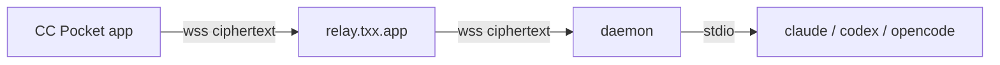

# CC Pocket

[](https://github.com/ac54u-mobile/cc-pocket/actions/workflows/ci.yml) [](https://github.com/ac54u-mobile/cc-pocket/releases/latest) [](LICENSE)

**English** | [简体中文](README.zh-CN.md)

Drive Claude Code / Codex / OpenCode on your computer from your phone over a **zero-knowledge E2E relay**. This repository is maintained by [ac54u-mobile](https://github.com/ac54u-mobile/cc-pocket); default relay is `wss://relay.txx.app`.

App ID: `com.txx.ccpocket`. Version lines are separate:

| Line | Tag | What’s in it |
|---|---|---|
| Daemon | `daemon-v*` | Host agent binary (GitHub **Latest**) |
| App | `app-v*` | Phone install package (TrollStore IPA) |

## Get it

| | Platform | Download |
|---|---|---|
| Phone | iOS 17+ (TrollStore) | [App releases](https://github.com/ac54u-mobile/cc-pocket/releases?q=app-v) |
| Daemon | macOS · Linux | `curl -fsSL https://raw.githubusercontent.com/ac54u-mobile/cc-pocket/main/scripts/install.sh \| bash` |
| Daemon | Windows | `irm https://raw.githubusercontent.com/ac54u-mobile/cc-pocket/main/scripts/install.ps1 \| iex` |

## Install & pair

1. Install the daemon on the computer that runs the agent CLI.
2. Run `cc-pocket-daemon pair` (QR + 6-digit code).
3. Open the phone app and scan / enter the code.

Default relay: `wss://relay.txx.app` (override with `CC_POCKET_RELAY`).

## How it works



## Docs

- [USAGE](docs/USAGE.md) — daily use
- [SECURITY](docs/SECURITY.md) — threat model
- [RUN](docs/RUN.md) — local development
- [RELEASE](docs/RELEASE.md) — publishing notes

## Build

```bash
./gradlew :daemon:installDist
./gradlew :mobile:composeApp:compileKotlinDesktop
bash scripts/check-all.sh
```

MIT — see [LICENSE](LICENSE).
